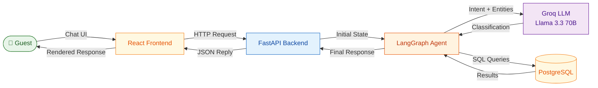
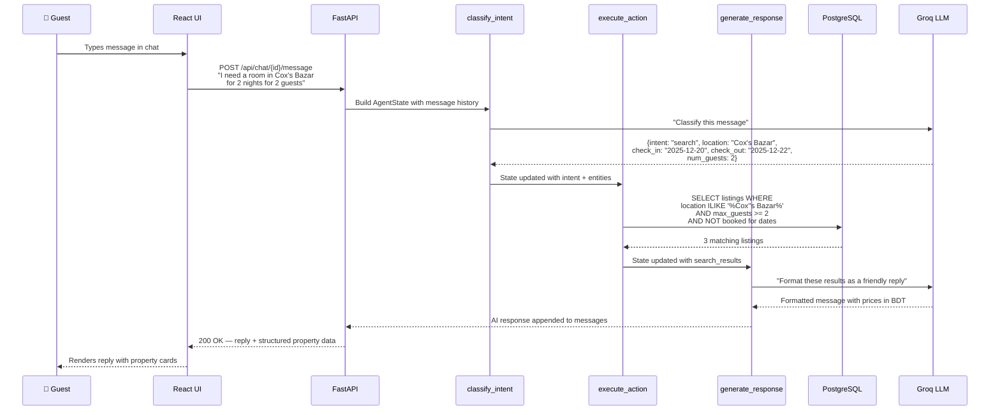
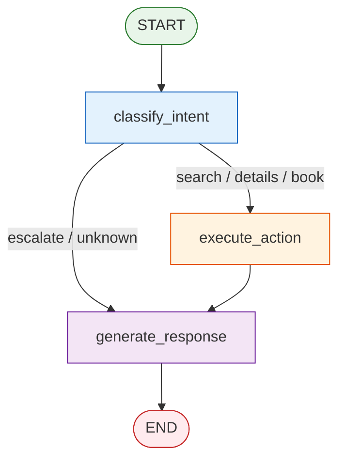
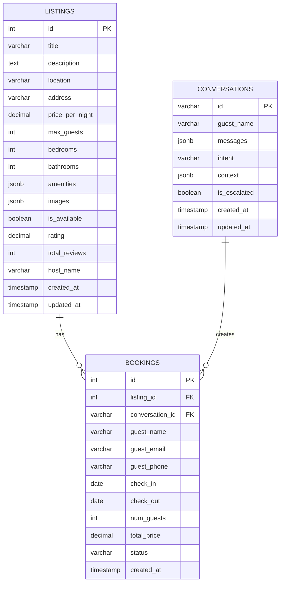

# StayEase — AI Booking Agent

An AI-powered booking assistant for **StayEase**, a short-term accommodation rental platform in Bangladesh. Built with **LangGraph**, **FastAPI**, **PostgreSQL**, **Groq LLM**, and a **React** chat interface, the agent handles property search, listing details, and booking creation through natural conversation — and gracefully escalates anything outside its scope to a human agent.

---

## Table of Contents

1. [System Overview](#1-system-overview)
2. [Conversation Flow](#2-conversation-flow)
3. [LangGraph State Design](#3-langgraph-state-design)
4. [Node Design](#4-node-design)
5. [Tool Definitions](#5-tool-definitions)
6. [Database Schema](#6-database-schema)
7. [Project Structure](#7-project-structure)
8. [Getting Started](#8-getting-started)

---

## 1. System Overview

The StayEase agent provides a **React** chat interface where guests type messages in natural language. The frontend communicates with a **FastAPI** backend via REST API. Each message is fed into a **LangGraph** state-machine that classifies the guest's intent, executes the appropriate database-backed tool (search, details, or book), and generates a natural-language reply using the **Groq LLM** (Llama 3.3 70B). Conversation state is persisted in **PostgreSQL** so multi-turn context is preserved across requests.



**Data flow:** Guest → React UI → FastAPI → LangGraph (classify → act → respond) → PostgreSQL ↔ LangGraph → FastAPI → React UI → Guest

---

## 2. Conversation Flow

### Example: *"I need a room in Cox's Bazar for 2 nights for 2 guests"*



**Step-by-step breakdown:**

| Step | Component | What Happens |
|------|-----------|-------------|
| 1 | **React UI** | Guest types a message in the chat interface — the frontend sends it to the backend via `POST /api/chat/{id}/message` |
| 2 | **FastAPI** | Receives the guest message, loads or creates the conversation record, and builds the initial `AgentState` |
| 3 | **classify_intent** | Sends the message to Groq LLM with a structured prompt — extracts `intent: "search"`, `location: "Cox's Bazar"`, `check_in`, `check_out`, `num_guests: 2` |
| 4 | **route_intent** | Conditional edge sees `intent == "search"` → routes to `execute_action` |
| 5 | **execute_action** | Calls `search_available_properties` tool — queries PostgreSQL for available listings matching criteria, excluding already-booked date ranges |
| 6 | **generate_response** | Feeds search results + conversation history to LLM — produces a friendly reply with property names, nightly rates in ৳ (BDT), ratings, and total prices |
| 7 | **FastAPI** | Persists the updated messages and context to PostgreSQL, returns JSON with the reply and structured `data.properties` array |
| 8 | **React UI** | Renders the AI reply as a chat bubble with interactive property cards showing name, rating, price per night, and total price |

---

## 3. LangGraph State Design

```python
class AgentState(TypedDict):
    messages: list[BaseMessage]        # Full message history — drives LLM context
    intent: str                        # Classified intent — routes to correct action node
    location: str | None               # Target city/area from the guest's query
    check_in: str | None               # Desired check-in date (ISO format)
    check_out: str | None              # Desired check-out date (ISO format)
    num_guests: int | None             # Number of guests the property must accommodate
    listing_id: int | None             # Specific listing for details/booking requests
    guest_name: str | None             # Guest name — required to finalise a booking
    guest_email: str | None            # Guest email — required to finalise a booking
    search_results: list[dict] | None  # Properties returned by the most recent search
    booking_confirmation: dict | None  # Confirmation payload after a successful booking
    conversation_id: str               # Ties this turn to a persistent DB conversation
    error: str | None                  # Populated on recoverable errors (missing info, etc.)
```

| Field | Why It Exists |
|-------|--------------|
| `messages` | Preserves full conversation context so the LLM can generate coherent multi-turn replies |
| `intent` | Drives conditional routing — determines which tool (if any) to execute |
| `location`, `check_in`, `check_out`, `num_guests` | Search parameters extracted from natural language — persisted across turns so the guest doesn't repeat themselves |
| `listing_id` | Identifies which property the guest is asking about or wants to book |
| `guest_name`, `guest_email` | Required for booking creation — collected across turns if not provided upfront |
| `search_results` | Passed from the action node to the response node so the LLM can format results naturally |
| `booking_confirmation` | Contains booking ID and total price for the confirmation message |
| `conversation_id` | Links the agent turn to the database record for persistence |
| `error` | Lets the response node explain what information is still needed |

---

## 4. Node Design



### Node Descriptions

| # | Node | What It Does | State Updates | Next Node |
|---|------|-------------|---------------|-----------|
| 1 | **classify_intent** | Sends the latest message to the LLM with a classification prompt and extracts the intent + entities as structured JSON | `intent`, `location`, `check_in`, `check_out`, `num_guests`, `listing_id`, `guest_name`, `guest_email` | `execute_action` (if actionable) or `generate_response` (if escalate/unknown) |
| 2 | **execute_action** | Calls the appropriate tool based on `intent` — `search_available_properties`, `get_listing_details`, or `create_booking` | `search_results` or `booking_confirmation` or `error` | `generate_response` |
| 3 | **generate_response** | Composes a natural-language reply using the LLM with tool results and conversation context injected into the system prompt | `messages` (appends AI reply) | `END` |

**Router function** — `route_intent` is a pure conditional edge (not a node). It reads `state["intent"]` and returns `"execute_action"` for actionable intents or `"generate_response"` for escalation/unknown.

---

## 5. Tool Definitions

### `search_available_properties`

| | |
|---|---|
| **When used** | Guest provides a location, dates, and guest count — intent is `"search"` |
| **Input** | `location: str`, `check_in: date`, `check_out: date`, `num_guests: int` |
| **Output** | `list[dict]` — up to 5 properties sorted by rating, each with `listing_id`, `title`, `location`, `price_per_night`, `total_price`, `max_guests`, `bedrooms`, `rating`, `total_reviews` |
| **Logic** | Queries listings matching location (case-insensitive) and capacity, excludes listings with overlapping confirmed bookings |

### `get_listing_details`

| | |
|---|---|
| **When used** | Guest asks about a specific property — intent is `"details"` |
| **Input** | `listing_id: int` |
| **Output** | `dict` — full listing with `title`, `description`, `address`, `price_per_night`, `amenities`, `images`, `rating`, `host_name`, etc. |
| **Logic** | Simple primary-key lookup; returns an error dict if listing not found |

### `create_booking`

| | |
|---|---|
| **When used** | Guest confirms they want to book — intent is `"book"`, all required fields are present |
| **Input** | `listing_id: int`, `guest_name: str`, `guest_email: str`, `check_in: date`, `check_out: date`, `num_guests: int`, `conversation_id: str` |
| **Output** | `dict` — confirmation with `booking_id`, `listing_title`, `check_in`, `check_out`, `num_guests`, `total_price`, `status` |
| **Logic** | Validates capacity and date range, calculates total price, creates a `confirmed` booking record |

---

## 6. Database Schema

### Entity-Relationship Diagram



### Table Details

#### `listings` — Rental properties available on the platform

| Column | Type | Notes |
|--------|------|-------|
| `id` | `SERIAL PRIMARY KEY` | Auto-incrementing identifier |
| `title` | `VARCHAR(200)` | Property display name |
| `description` | `TEXT` | Full property description |
| `location` | `VARCHAR(100)` | City/area name — indexed for search |
| `address` | `VARCHAR(300)` | Full street address |
| `price_per_night` | `NUMERIC(10,2)` | Nightly rate in BDT |
| `max_guests` | `INTEGER` | Maximum occupancy |
| `bedrooms` | `INTEGER` | Number of bedrooms |
| `bathrooms` | `INTEGER` | Number of bathrooms |
| `amenities` | `JSONB` | List of amenity strings |
| `images` | `JSONB` | List of image URLs |
| `is_available` | `BOOLEAN` | Global availability toggle |
| `rating` | `NUMERIC(2,1)` | Average guest rating (0.0–5.0) |
| `total_reviews` | `INTEGER` | Review count |
| `host_name` | `VARCHAR(100)` | Property host name |
| `created_at` | `TIMESTAMPTZ` | Record creation time |
| `updated_at` | `TIMESTAMPTZ` | Last modification time |

#### `bookings` — Guest reservations

| Column | Type | Notes |
|--------|------|-------|
| `id` | `SERIAL PRIMARY KEY` | Auto-incrementing identifier |
| `listing_id` | `INTEGER FK → listings.id` | Booked property |
| `conversation_id` | `VARCHAR(36) FK → conversations.id` | Originating conversation |
| `guest_name` | `VARCHAR(100)` | Guest's full name |
| `guest_email` | `VARCHAR(200)` | Guest's email |
| `guest_phone` | `VARCHAR(20)` | Optional phone number |
| `check_in` | `DATE` | Check-in date |
| `check_out` | `DATE` | Check-out date |
| `num_guests` | `INTEGER` | Number of guests |
| `total_price` | `NUMERIC(10,2)` | Calculated total in BDT |
| `status` | `VARCHAR(20)` | `confirmed` / `cancelled` / `completed` |
| `created_at` | `TIMESTAMPTZ` | Booking creation time |

#### `conversations` — Chat sessions

| Column | Type | Notes |
|--------|------|-------|
| `id` | `VARCHAR(36) PK` | UUID string |
| `guest_name` | `VARCHAR(100)` | Guest's name (if provided) |
| `messages` | `JSONB` | Array of `{role, content, timestamp}` |
| `intent` | `VARCHAR(50)` | Latest classified intent |
| `context` | `JSONB` | Extracted entities (location, dates, etc.) |
| `is_escalated` | `BOOLEAN` | Whether the conversation was escalated |
| `created_at` | `TIMESTAMPTZ` | Session start time |
| `updated_at` | `TIMESTAMPTZ` | Last activity time |

---

## 7. Project Structure

```
stayease-agent/
├── README.md              # Architecture document (this file)
├── api.md                 # API contract documentation
├── requirements.txt       # Python dependencies
├── .env.example           # Environment variable template
├── .gitignore
│
├── agent/                 # LangGraph agent
│   ├── __init__.py
│   ├── state.py           # AgentState TypedDict
│   ├── nodes.py           # Node functions (classify, execute, respond)
│   ├── tools.py           # @tool definitions with Pydantic schemas
│   └── graph.py           # Graph construction and compilation
│
├── app/                   # FastAPI application
│   ├── __init__.py
│   ├── main.py            # API endpoints (with CORS enabled)
│   └── schemas.py         # Request/response Pydantic models
│
├── db/                    # Database layer
│   ├── __init__.py
│   ├── database.py        # Async engine and session factory
│   └── models.py          # SQLAlchemy ORM models
│
└── frontend/              # React chat interface (Vite)
    ├── package.json
    ├── vite.config.js
    └── src/
        ├── main.jsx       # App entry point
        ├── App.jsx        # Chat UI with property & booking cards
        └── index.css      # Global styles
```

---

## 8. Getting Started

### Prerequisites

- Python 3.10+
- Node.js 18+
- PostgreSQL 14+
- A [Groq API key](https://console.groq.com)

### Backend Setup

```bash
# Clone the repository
git clone https://github.com/AArafatt/stayease-agent.git
cd stayease-agent

# Create virtual environment
python -m venv venv
source venv/bin/activate

# Install dependencies
pip install -r requirements.txt

# Configure environment
cp .env.example .env
# Edit .env with your GROQ_API_KEY and DATABASE_URL

# Create PostgreSQL database
psql -U postgres -c "CREATE DATABASE stayease;"

# Start the backend server
uvicorn app.main:app --reload --port 8000
```

The API documentation is available at `http://localhost:8000/docs` (Swagger UI).

### Frontend Setup

```bash
cd frontend
npm install
npm run dev
```

The chat interface will be available at `http://localhost:5173`.

### Features

- Real-time chat interface with typing indicators
- Property search result cards with ratings and BDT pricing
- Booking confirmation cards
- Suggested query prompts for quick start
- Multi-turn conversation with context persistence
- Responsive design
